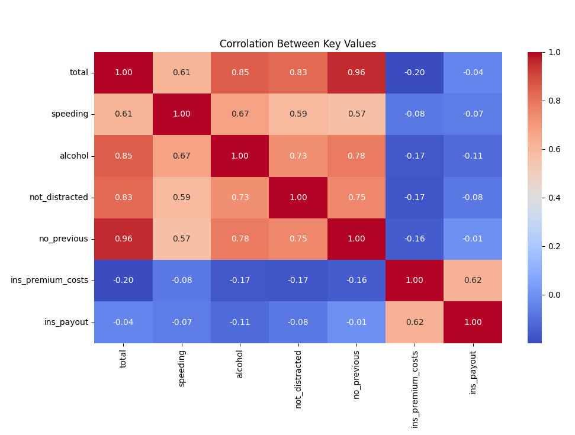

# CarCrashDataSet

## 📄 Description

This project analyzes car crash data from Seaborn's built-in dataset, car_crashes. The goal is to explore patterns and correlations in the data, such as the relationship between speeding, alcohol consumption, and crash totals. The project uses Python for data analysis and visualization with libraries like Pandas, NumPy, Seaborn, and Matplotlib.


## 📊 Key Features

- **Data Preprocessing:**
  - Renamed columns for better readability.
  - Checked for null values to ensure data quality.
- **Descriptive Statistics:**
  - Provided summary statistics such as mean, standard deviation, min, and max.
- **Insights:**
  - Identified states with the highest insurance premiums and crash totals.
- **Visualizations:**
  - Bar graphs, scatter plots, histograms, and heatmaps to represent the data.
- **Correlation Analysis:**
  - Heatmap to highlight relationships between variables.


## 🛠️ Technologies Used

**Python:** Programming language used for analysis.
**NumPy:** Numerical computations.
**Pandas:** Data manipulation and analysis.
**Seaborn:** Statistical data visualization.
**Matplotlib:** Plot customization and creation.


## 📂 Project Structure
```bash
Car_Crashes_Analysis/
├── data.py                # Main Python script for the analysis
├── README.md              # Documentation for the project
```


## 📈 Visualizations

1.  Speeding Per State
2. Relationship Between Speeding and Crashes
3. Alcohol Involvement in Crashes
4. Correlation Heatmap


## 🚀 How to Run the Project

1. Clone this repository:
```bash
git clone https://github.com/your_username/Car_Crashes_Analysis.git
```

2. Navigate to the project directory:
```bash
cd Car_Crashes_Analysis
```

3. Install the required libraries:
```bash
pip install numpy pandas seaborn matplotlib
```

4. Run the script:
```bash
python data.py
```

## 🖼️ Sample Visualizations


## 🛡️ License
This project is licensed under the MIT License - see the LICENSE file for details.


## 🤝 Contributing
Contributions are welcome! Feel free to fork this repository and submit a pull request.


